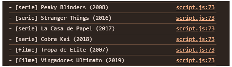
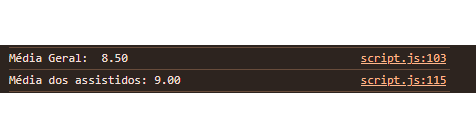
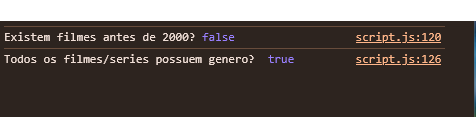
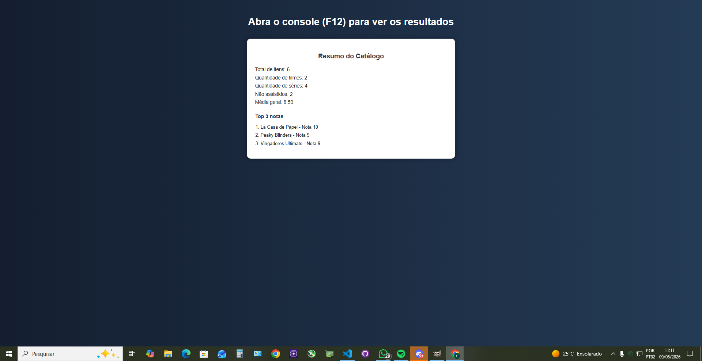

# Trabalho Prático - Semana 8

Nesta atividade, você irá fazer exercícios de programação com o objetivo de praticar a manipulação de objetos e arrays em JavaScript, passando pela definição de dados em notação **JSON (JavaScript Object Notation)**, acessando propriedades e itens, e usando iterators para processar os dados e gerar resultados.

## Informações Gerais

- Nome: Francisco Leite de Jesus
- Matrícula: 927761

## Prints do console do navegador

 - LISTAGEM DE TÍTULOS - 
 

 - CÁLCULO DE MÉDIAS - 
 

<<- RESUMO DE VERIFICAÇÕES (SOME E EVERY) - 

- PÁGINA COM O RESUMO - 
